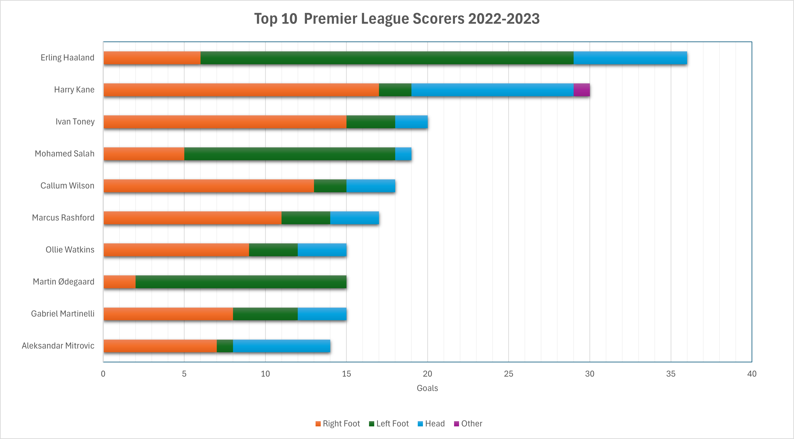

# PAC2: Tres tècniques de visualtizació de dades

## Stacked Bar Graphs
### Top Scorers in Premier League. Season 2022-2023

This chart displays the top 10 scorers of the Premier League Season 2022-2023.

- **Data:** [Top Scorers Data](/data/TopScorersPL22_23.csv)
- **Source:** Whoscored.com [Link](https://www.whoscored.com/Statistics)

---

## Flow Map
### Ukrainian Refugees Migration Map

This visualization illustrates the flow of Ukrainian refugees from Ukraine to other countries since the full-scale invasion of Ukraine on the 22nd of February 2022. Data was collected on the 7th of April 2024.

Explore the interactive representation [here](https://app.flowmap.city/public/5cb30e27-1ffd-4bff-8b4a-fe588a95a047).

- **Data:** [Ukrainian Refugees Data](/data/ukranian_refugees_data.csv)
- **Source:** Office of the High Commissioner for Refugees (UNHCR). [Link](https://data.unhcr.org/en/situations/ukraine)

---

## Hyperbolic Tree
### Structure of the Orquesta de Cadaqués

This visualization showcases the structure and names of the members of the Orquestra de Cadaqués. Created with [HyperTree Studio.](https://hypertree-studio.soft112.com) 

To fully explore it, download the free software and import the data.

- **Data:** [Orchestra Data](/data/orchestra.xml)
- **Tree:** [Export the tree](images/orquestra_tree.htz)
- **Source:** [Orquestra de Cadaqués](http://www.orquestradecadaques.com/ca/integrants)

